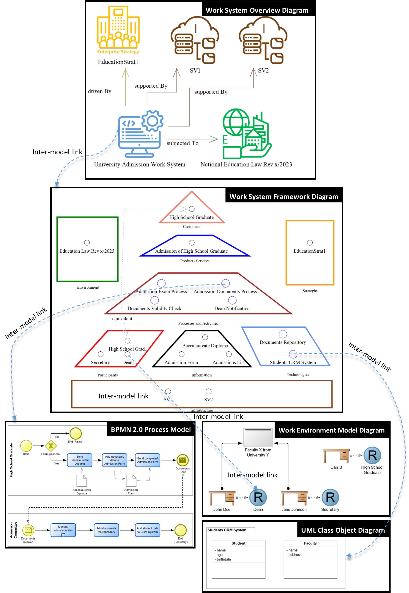
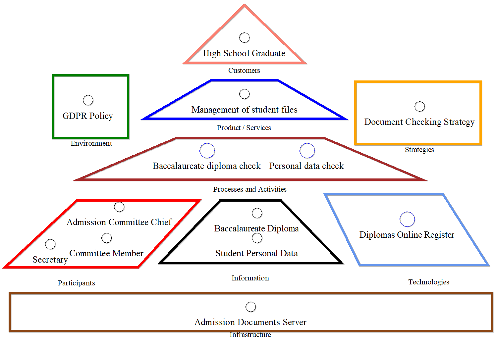

# WSTBPMN

In the following, a modeling scenario where the WSTBPMN tool was used, is presented.

This scenario pertains to the admission process of a new student into a university faculty, as illustrated in the figure below.

Following the Work System Framework (WSF), the customer in this work system is a high school graduate seeking enrollment for the upcoming academic year. The service outcome of the work system is the successful admission of the candidate, thereby transitioning their status from high school graduate to university student. The primary processes involved include:
- The candidate taking the admission exam.
- Submission of the required documentation (baccalaureate diploma, admission form) to the faculty upon passing the exam.
- Validation of the documents by the faculty secretary.
- Notification of the admission status, which is subsequently communicated to the dean of the faculty.

According to the Work System Framework, the following participants are involved:
- High school graduate, serving a dual role as both the customer and an active participant in certain processes.
- Faculty secretary, responsible for administrative validation.
- Faculty dean, overseeing and approving admission outcomes.

The information elements within this work system comprise:
- Baccalaureate diploma
- Admission form
- Admission list, containing the names of all accepted students.

From a technological perspective, the work system is underpinned by a repository for admission documents and a student CRM system. Strategically, the work system aligns with EducationStrat1, which mandates the annual organization of admissions to facilitate student enrollment and sustain institutional growth.

The infrastructure supporting this work system consists of two servers (SV1 and SV2), designated for document storage and CRM operations. From a regulatory standpoint, the system operates under the National Education Law, Revision X / 2023, which stipulates the legal framework for conducting university admission examinations.

Furthermore, all elements within the Work System Framework Diagram can be systematically linked to additional modeling paradigms, including BPMN, UML, and the Work Environment Model, thereby ensuring a cohesive and extensible framework for system representation.

Another important aspect supported by the modeling tool is represented by the ability to model subsystems, as a special kind of BPMN subprocesses, contextualizing them as WSF diagrams from a semantics point of view. Semantic traceability for Enterprise Architecture purposes is enabled by inter-model hyperlinks, leveraging the bridge created between WST specific concepts and diagrammatic models.
An example of subsystem representation can be seen below:

